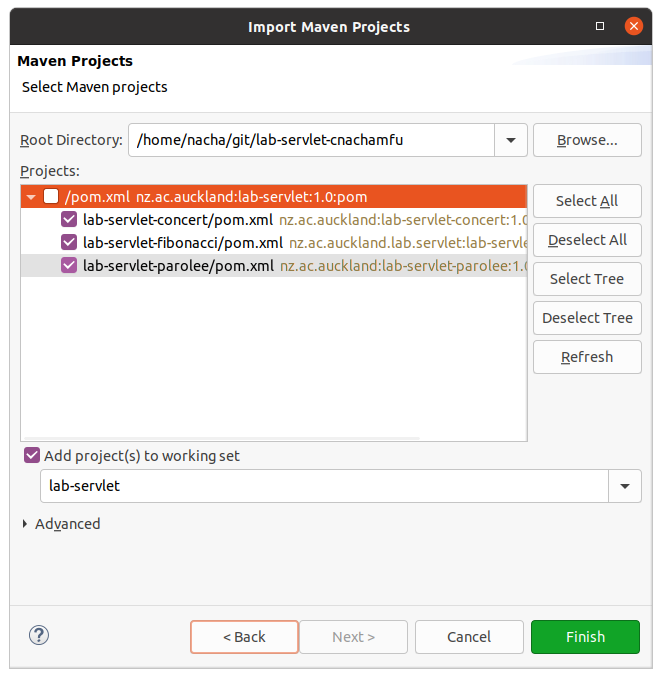
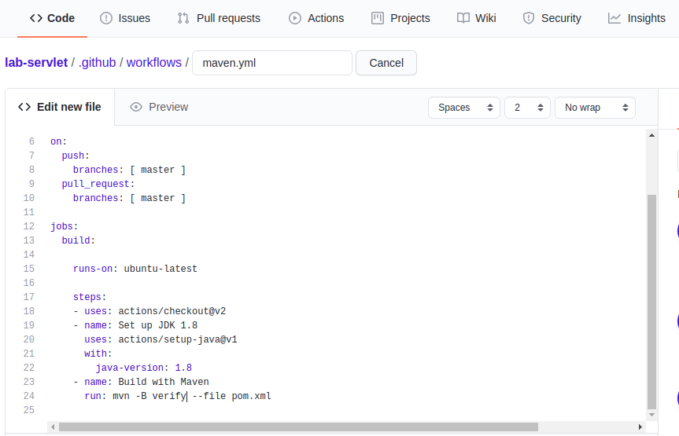

Lab - Webservice
==========

Before you start
----------
The purpose of this lab is to give you some practical experience with configuring and developing simple REST Web services. You will work with a servlet container, first directly with servlets and then with JAX-RS.


Exercise One - Build the supplied Fibonacci Servlet application
----------
The `lab-servlet-fibonacci` project contains a Web application that is implemented using a servlet. The project includes:

- `RabbitCounterServlet`, located in the `src/main/java` directory. This is a servlet that implements a REST Web service for manipulating numbers in the Fibonacci sequence. The servlet responds to HTTP GET requests to retrieve either a value at a particular position within the sequence, or all Fibonacci values known to the Web service. It responds to HTTP POST requests to generate and store values for specified positions within the sequence, and, for HTTP DELETE requests, it deletes the value at a specified sequence position.

- `RabbitCounterCounsumerIT`, located in the `src/test/java` directory. This is a JUnit integration test for testing the functionality of the Web service.

- `web.xml`, Located in the `src/main/webapp` directory. This is the mandatory configuration file for a WAR (Web application ARchive) application.

- `pom.xml`, a minimal POM file that defines the output of the build process to be a WAR file (note the `<packaging>` element). In addition, the POM file specifies dependencies on the servlet library, necessary to compile and run `RabbitCounterServlet`, slf4j logging and JUnit.

###### Project structure
The project is structured as a Maven single-module project, and includes the directory structure for storing the `web.xml` file: `src/main/webapp/WEB-INF/web.xml`. Where the POM's `<packaging>` element's value is `war`, the `web.xml` file is expected to be stored in the `WEB-INF` directory, and Maven's `package` phase generates a `war` file as opposed to a `jar` (which is the default).

The structure of a `war` file is well specified; it includes a directory named `WEB-INF` that contains the `web.xml` file and two subdirectories: `classes` and `lib`. `classes` contains the Web application's compiled code and any other resources, and `lib` contains any third-party libraries (`jar` files). Since a `war` file has a well-defined structure, any servlet container, e.g. Jetty or Tomcat, can be used to host the Web application contained in the `war` file. You might want to view the contents of the Fibonacci `war` file once you've built the application - you'll be able to find it in the projects `target` folder once built, and can view it using any program capable of opening Zip archives, such as 7-Zip.

The purpose of the `web.xml` file is to specify the servlet class and url pattern for which the servlet will process HTTP requests. The supplied file names the servlet `RabbitCounter` and declares that the servlet class is `lab.servlet.fibonacci.RabbitCounterServlet`. It also specifies that the servlet will process HTTP requests where the domain name has a `rabbit` suffix. Where the domain name prefix is `localhost`, requests of the form `http://localhost/rabbit` would be routed through to the `RabbitCounter` servlet.

#### (a) Import the project
Import the project into your IDE, following the same procedure in the previous lab. After you configure the parent project as a maven project, you have to import the three child projects into the workspace. In order to do this, go to import->Maven->Existing maven project. Then, select only pom files of child projects to import as shown in the figure below. 



#### (b) Flesh out the POM file
As part of the Maven build process, Maven can arrange for the packaged Web service to be deployed in an *embedded* servlet container. An embedded container is one that runs in the same process as the client (integration tests in this case) that will invoke the Web application hosted by the container.

Just before the `integration-test` phase, you want Maven to start up the embedded servlet container and host the Web application. Once started, you want Maven to run the integration test. When the tests have finished, Maven should shutdown the servlet container. The use of an embedded servlet container in this way is very convenient for development and testing - you don't need to install and run a full standalone servlet container or repeatedly redeploy the WAR file every time you recompile the code. Using build tools like Maven in this way thus promotes *testability* of distributed applications.

To effect the above approach to integration testing, you need to configure two plugins:

- `Failsafe`. This is Maven's plugin for running integration tests. It runs any JUnit tests in the `src/test/java` directory with an *"IT"* (integration test) suffix (for example, `RabbitCounterCounsumerIT`).

- `Jetty`. The Jetty plugin runs the embedded Jetty servlet container.

A description of how to configure the two plugins so that Jetty starts up and deploys the Web application prior to running the integration tests, and shuts down afterwards, is available at:

- http://maven.apache.org/surefire/maven-failsafe-plugin/usage.html

Other than what's described in the above web page, you need additional declarations in the `configuration` element of the Jetty plugin:

```xml
<plugin>
    <groupId>org.eclipse.jetty</groupId>
    <artifactId>jetty-maven-plugin</artifactId>
    <version>${jetty.version}</version>
    <configuration>
        <httpConnector>
            <port>${servlet.container.port}</port>
        </httpConnector>
        <scanIntervalSeconds>10</scanIntervalSeconds>
        <stopPort>9000</stopPort>
        <stopWait>10</stopWait>
        <stopKey>STOP</stopKey>
    </configuration>
    <executions>
        <execution>
            <id>start-jetty</id>
            <phase>pre-integration-test</phase>
            <goals>
                <goal>start</goal>
            </goals>
        </execution>
        <execution>
            <id>stop-jetty</id>
            <phase>post-integration-test</phase>
            <goals>
                <goal>stop</goal>
            </goals>
        </execution>
    </executions>
</plugin>
```

The `httpConnector` specifies the port that the servlet container will listen on for incoming connection requests.

If you get really stuck with configuring the plugins, look ahead to the project for exercise two,  `lab-servlet-parolee`. The POM for this configures the plugins as required for a different Web application project.

#### (c) Build and run the project locally
To build and run the project, run Maven with the `verify` goal. This will compile, package (generating the WAR file), and run the integration tests on the deployed Web service. The integration tests should run without error.

#### (d) Build and run the project on GitHub
On Github, you can setup a CI-CD workflow to automatically build and test your project when you push the code. TO create a workflow, go to workflow tab on your github repository and choose `Java with Maven`. Github will generate a maven.yml file and allow you to edit. You can edit the maven command on the last line to specify the maven goal to run. Also, please make sure to use Java 11 for building as maven failsafe plugin require. To test this workflow, you can push the code to your repository and see the log in the workflow tab.


#### (e) Reflect on the project
Study the code to ensure you understand it, and think about the following questions. Record your thoughts here and in your journal:

- How does use of the servlet container and programming model simplify application development? Consider what would be involved if you had to write your own HTTP server.

```

```

- In what way is servlet programming still "low-level" programming? 

```

```

- How does the servlet leverage the HTTP protocol?

```

```

- Why is the servlet's state (`cache`) a threadsafe `Map`?

```

```


Exercise Two - Build the supplied Parolee JAX-RS application
----------
Project `lab-servlet-parolee` is a simple JAX-RS project. It provides a REST Web service that allows clients (consumers) to retrieve, create, update and delete parolees.

From version 3.0 of the Servlet specification, servlet containers are JAX-RS aware. This means that they automatically load the JAX-RS servlet class (`HttpServletDispatcher`) at startup time. Since you are packaging a WAR project, you still need a `web.xml` file - but it can be empty as the servlet container knows which `Servlet` class to instantiate. Hence, the `web.xml` file for this project is empty.
 
JBoss' RESTEasy implementation of JAX-RS is used, and several necessary dependencies are specified in the POM.

#### (a) Import, build and run the project
The project is complete and ready to build. Import the project into your IDE. Build and run the project, similarly to how you did for exercise one.

#### (b) Experiment with logging
The project's POM file includes additional dependencies for logging, including the log4j implementation. The behaviour of log4j is configured using the `log4j.properties` file. A sample file is included with the project in `src/main/resources`. 

When developing HTTP applications, it's often useful to examine the contents of HTTP messages. The JAX-RS implementation uses a HTTP library that uses logging. This project's `log4j.properties` file can be used to control what the HTTP library outputs. By default, the properties file causes only INFO-level logging to be output. However, you can specify the logging level for particular namespaces, e.g. DEBUG for package `org.apache.http`:

```
log4j.logger.org.apache.http=DEBUG
```

This causes DEBUG-level messages (in addition to INFO-level messages) to be output by any code in package `org.apache.http` or its subpackages. When set to DEBUG, a lot of useful information about HTTP messages, including headers, payloads and response codes is logged, and, in the case of the supplied `log4j.properties` file, displayed to stdout.

After editing the properties file, rebuild and run the project so that you can examine the contents of the HTTP messages being generated by JAX-RS and exchanged between the client and Web service.

#### (c) Reflect on the project
Study how the JAX-RS API is used in this simple project. Consider & record:

- The way in which the REST interface offers CRUD functionality for parolee resources.

- The abstraction offered by the the JAX-RS framework over basic servlet programming.

- Aspect(s) of the `lab-servlet-parolee` project that you think could be better addressed by the JAX-RS framework.

```

```

Exercise Three - Develop a JAX-RS Concert service
----------
Project `lab-servlet-concert` is a partially complete JAX-RS project for a simple REST Web service that manages concerts. The project includes a skeleton Web service implementation (`ConcertResource`), an integration test (`ConcertResourceIT`), a class to represent concerts (`Concert`) and a complete POM. 

The service is to provide the following REST interface:

- `GET /concerts/{id}`, retrieves a `Concert` based on its unique id. The HTTP response code is either 200 or 404, depending on the existence of the required concert.

- `GET /concerts ? start & size`, retrieves a `List` of `Concerts` where the `start` query parameter specifies the `id` of the first concert to retrieve, and the `size` parameter is the maximum number of concerts to return (with increasing ids).

- `POST /concerts`, creates a new `Concert`. The HTTP request message should contain a `Concert` for which to generate an `i` and store in the Web service. The response message should have a status code of 201 and a `Location` header giving the URI of the new `Concert`.

- `DELETE /concerts`, deletes all concerts known to the Web service. The HTTP response message's status code should be 204.

Instead of using JSON (as with the Parolee service), this service is to use Java serialization as the format for exchanging `Concert` data in HTTP request and response message bodies. In addition, the service is to track a client session using a HTTP cookie.

#### Complete the application
Begin by importing the `lab-servlet-concert` project into your IDE. Complete the application service, implementing the necessary `Application` subclass and fleshing out the `ConcertResource` class. For `ConcertResource`, you need to add instance variables, method bodies and all metadata (JAX-RS annotations).

###### Use of Java serialization
The JAX-RS framework is extensible with respect to data formats (more on this in Lecture 05). For this project, a class named `SerializedMessageBodyReaderAndWriter` is provided that plugs into the JAX-RS framework and which manages the conversion of serialized data in HTTP message bodies to `Serializable` Java objects. You don't need to be familiar with the details of this class' implementation - suffice it implements two JAX-RS interfaces `MessageBodyReader` and `MessageBodyWriter`. Any implementation of these interfaces can be registered with the JAX-RS framework to manage conversion between some format and Java objects.

The `SerializedMessageBodyReaderAndWriter` is already registered on the client-side in class `ConcertResourceIT` (see the `createClient()` method). For the server-side, you'll need to handle registration in your `Application` subclass. To do this you should override `Application`'s `getClasses()` method to return a `Set` that contains the `SerializedMessageBodyReaderAndWriter` class.

```java
private Set<Class<?>> classes = new HashSet<Class<?>>();

public ConcertApplication() {
  ...
  classes.add(SerializationMessageBodyReaderAndWriter.class);
}

@Override
public Set<Class<?>> getClasses() {
  return _classes;
}
```

When the JAX-RS runtime loads your `Application` subclass on startup, it calls both the `getSingletons()` and `getClasses()` methods. It instantiates classes obtained from `getClasses()` as necessary, and in the case of `SerializedMessageBodyReaderAndWriter`, it uses an instance to convert Java objects to and from their bytecode representations when reading and writing HTTP messages. Note that your `Application` subclass must also override `getSingletons()` to return an instance of `ConcertResource` - as discussed in lectures.

Using the registered `MessageBodyReader` and `MessageBodyWriter` support for the Java serialization format means that you don't need to manually parse and generate the payload data for the HTTP request and response messages (as with project `lab-servlet-parolee`). The `Concert` objects being exchanged between consumers and the service will automatically be converted to their byte-representation. Despite being a text-based protocol, HTTP can store binary data in HTTP message bodies.

`SerializedMessageBodyReaderAndWriter` defines a new MIME type:

- `application/java-serialization`

The client (`ConcertResourceIT`), when preparing a Web service request, specifies this as its preferred content type. Similarly, in `ConcertResource`, you should use appropriate metadata annotations to specify that methods that produce or consume content do so using this data format. As you can see in `ConcertResource`, the method signatures are written to use class `Concert` directly - unlike the `lab-servlet-parolee` project, there's no need to use stream I/O.

###### Stateless communication protocol
As discussed in class, HTTP is a stateless protocol. A JAX-RS Web service thus processes each incoming request without knowledge of earlier requests. The Concert Web service is required to track each client that is making requests of the service, and should recognise when requests are being made by the same client. Hence, each client is to be assigned a unique identity by the service, and should include this identity as part of each HTTP request.

In developing a client-tracking mechanism, you should use HTTP cookies. The first time a client sends a request to the Web service, it won't have a cookie - in which case the service should generate one and return it in the HTTP response corresponding to the request. On all subsequent invocations, the HTTP request message should contain the cookie, thereby identifying the client that made the request. In a Web service that stores data for clients in a database, the cookie value could be used to retrieve data associated with the requesting client (more on the use of databases for persistence later).

####Github Classroom
After you finish all exercises and push the code to the repository on Github, Please check if the execution of `Github classroom workflow` runs successfully without any test fails.


#### Suggestions and resources
In developing class `ConcertResource`, you should read the JAX-RS API Javadoc, in particular for:

- `javax.ws.rs.core.Response`
- `javax.ws.rs.core.Response.Builder`
- `javax.ws.rs.core.Cookie`
- `javax.ws.rs.core.NewCookie`

Studying the `lab-servlet-parolee` project will be helpful too. In addition, have a look at the `ConcertResourceIT` class, and be sure to read the comments in the `ConcertResource` class.

Javadoc documentation for JAX-RS (which is part of Java Enterprise Edition) is available at:

- <https://docs.oracle.com/javaee/7/api/>